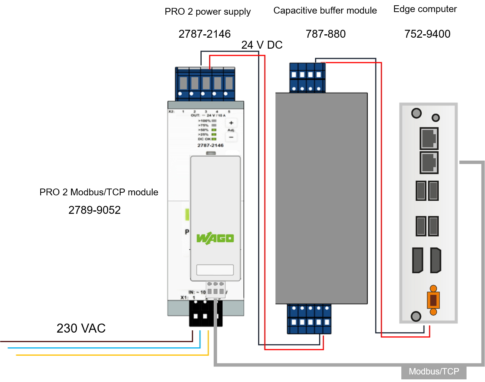

# Power Supply Control


## Description
Managing a proper shutdown of an Edge computer can be necessary in order to prevent any loss or corruption of data. 
In this architecture based on a WAGO devices (752 Edge computer, PRO 2 power supply, PRO 2 Modbus/TCP communication module, and 787-880 Capacitive module), the Edge computer reads out the state of the power supplies and manage to shut down itself in case of a power loss. 
By executing the command line below, a Python script will be downloaded with its dependencies, and installed as a service. 
This script reads out the Modbus register 1282 of the communication module in order to get the "DCOk" value. 
The capacitive buffer module lasts long enough in order to shut down properly before the complete power off.
(1m30 with only the power consumption of 752-9400, without USB devices).  

<div style="text-align: center">

</div>

## Installation

This requires an Internet access on the Edge computer. 
Using the SSH interface, connected as root user, execute the following command :

```
git clone https://github.com/quenorha/powersupplycontrol powersupplycontrol && chmod +x ./powersupplycontrol/install.sh && ./powersupplycontrol/install.sh
```

## Evolution
The Edge computer should be configure in AT mode (boot when power supplied), by setting the internal DIP switches SW1 to 1 : OFF and 2 : ON
This way, it boots up automatically when the power supply is on again. 
The process should be improve though, because if the network supply is available again after the Edge computer has shut down, and before the capacitive buffer is completely empty, it won't never boot by itself :(
